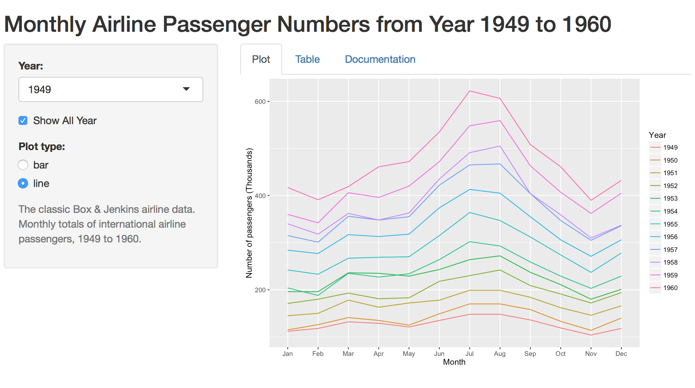
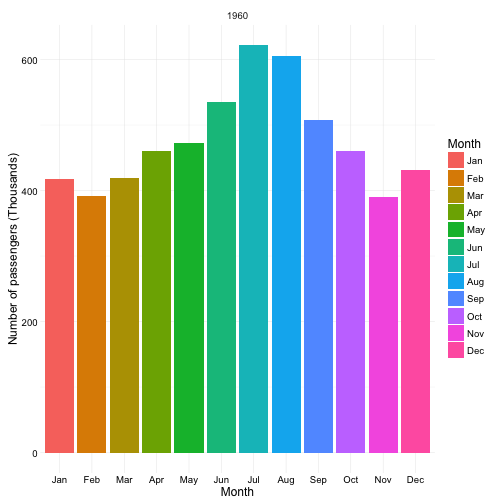
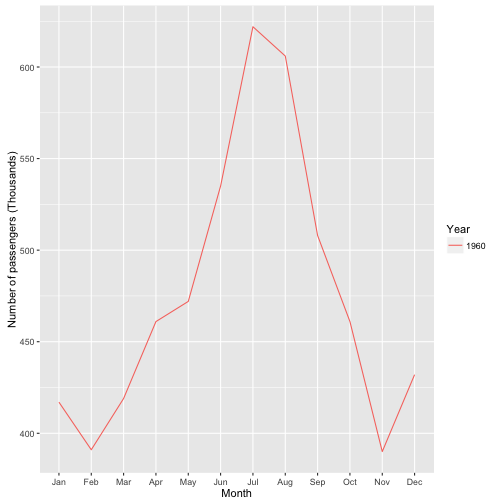

'airpassengers' Pitch Presentation
========================================================
author: Jamhiriah Jilani
date: 26th January 2016

Data Science : Reproducible Pitch Presentation

Introduction
========================================================

- 'airpassengers' is a simple shiny web application that is displaying data taken from AirPassengers dataset in the datasets package.

- It shows the monthly airline passenger numbers from year 1949 to 1960 using a bar, line plot and also a datatable.

- It provides an option for a person to select year, show all year and select plot type using available input widgets.

- It is also completed with a nice data table and basic documentation.

Data Science : Reproducible Pitch Presentation

========================================================

- The application is stored at **https://jamhiriah.shinyapps.io/airpassengers/**

</img>

Data Science : Reproducible Pitch Presentation

Output Samples:
========================================================

 
***

 

Finally...
========================================================
As the first application built by me using R and shiny, this is just a simple 
one. 

Looking forward to increase more knowledge and familiarity with R and shiny so that more applications can be build in the future.

Data Science : Reproducible Pitch Presentation

